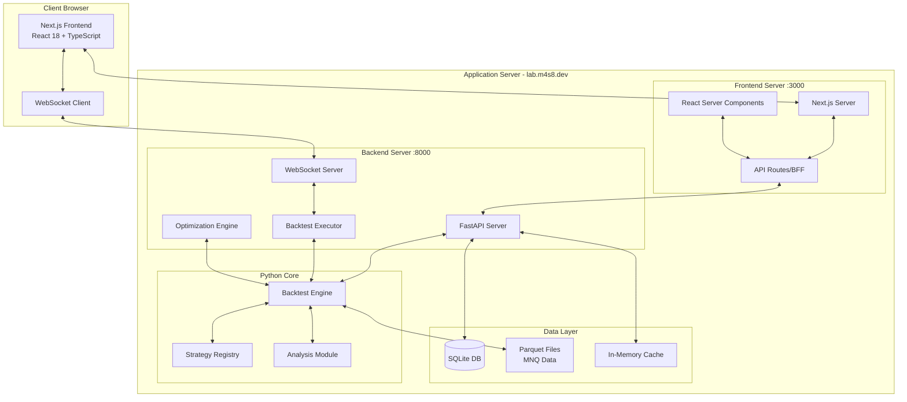
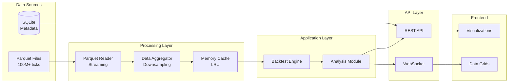

# Strategy Lab Web UI - System Architecture Document

**Version**: 1.0
**Date**: 2025-08-06
**Architect**: Winston
**Status**: Complete Technical Specification
**Target Environment**: Private server (lab.m4s8.dev) behind VPN

---

## 1. Executive Summary

### 1.1 Architecture Vision
A high-performance, single-user web application for backtesting control and analysis, built with Next.js frontend and FastAPI backend. The architecture prioritizes speed, real-time updates, and developer productivity while maintaining simplicity appropriate for a single-user environment.

### 1.2 Key Architectural Decisions
- **Next.js 14+ with App Router** for modern React development with server components
- **FastAPI** for high-performance Python backend with WebSocket support
- **SQLite** for simple, file-based persistence without database server overhead
- **Direct file system access** to Parquet data files for maximum performance
- **In-process caching** instead of distributed cache systems
- **WebSocket-first** for real-time updates without polling

### 1.3 Design Principles
1. **Performance over abstraction** - Direct access patterns where beneficial
2. **Monolithic simplicity** - No microservices complexity for single user
3. **Progressive enhancement** - Start simple, add complexity only when needed
4. **Data locality** - Keep data close to computation
5. **Developer experience** - Fast iteration with hot reload and TypeScript

---

## 2. System Architecture Overview

### 2.1 High-Level Architecture



### 2.2 Component Responsibilities

| Component | Responsibility | Technology |
|-----------|---------------|------------|
| **Frontend** | UI rendering, user interactions | Next.js, React, TypeScript |
| **API Gateway** | Request routing, data aggregation | Next.js API Routes |
| **Backend API** | Business logic, data processing | FastAPI |
| **WebSocket Server** | Real-time updates, streaming | FastAPI WebSockets |
| **Backtest Engine** | Strategy execution, metrics | Python, hftbacktest |
| **Data Layer** | Persistence, caching | SQLite, Parquet, Memory |

---

## 3. Frontend Architecture

### 3.1 Next.js Application Structure

```typescript
// File Structure
strategy-lab-ui/
├── app/                         // App Router
│   ├── layout.tsx              // Root layout with providers
│   ├── page.tsx                // Dashboard home
│   ├── (dashboard)/            // Dashboard route group
│   │   ├── layout.tsx          // Dashboard shell
│   │   ├── backtests/
│   │   │   ├── page.tsx        // Backtest list
│   │   │   ├── [id]/
│   │   │   │   └── page.tsx    // Backtest details
│   │   │   └── new/
│   │   │       └── page.tsx    // New backtest config
│   │   ├── strategies/
│   │   │   ├── page.tsx        // Strategy management
│   │   │   └── [id]/
│   │   │       └── page.tsx    // Strategy details
│   │   ├── results/
│   │   │   ├── page.tsx        // Results browser
│   │   │   └── [id]/
│   │   │       └── page.tsx    // Result analysis
│   │   ├── trades/
│   │   │   └── page.tsx        // Trade explorer
│   │   └── optimization/
│   │       └── page.tsx        // Optimization control
│   └── api/                    // API Routes (BFF)
│       ├── backtests/
│       ├── strategies/
│       └── metrics/
```

### 3.2 Component Architecture

```typescript
// Core Component Hierarchy
interface ComponentArchitecture {
  // Layout Components
  AppShell: {
    CommandBar: CommandPalette,
    Navigation: SideNav | TopNav,
    Content: MainContent,
    StatusBar: SystemStatus
  },

  // Feature Components
  Dashboard: {
    MetricsGrid: MetricCard[],
    ActivityFeed: ActivityItem[],
    QuickActions: ActionButton[],
    SystemHealth: ResourceMonitor
  },

  // Data Components
  DataGrid: {
    VirtualScroller: ReactWindow,
    ColumnConfig: ColumnDef[],
    RowActions: ActionMenu,
    Export: ExportHandler
  },

  // Visualization Components
  Charts: {
    EquityCurve: LineChart,
    DrawdownChart: AreaChart,
    TradeScatter: ScatterPlot,
    Heatmap: HeatmapGrid,
    OrderBook: DepthChart
  }
}
```

### 3.3 State Management Architecture

```typescript
// Zustand Store Structure
interface StoreArchitecture {
  // Application State
  appStore: {
    theme: 'dark',
    commandPaletteOpen: boolean,
    notifications: Notification[],
    shortcuts: KeyboardShortcut[]
  },

  // Backtest State
  backtestStore: {
    activeBacktests: Map<string, Backtest>,
    queue: BacktestJob[],
    results: Map<string, BacktestResult>,
    subscribe: (id: string) => void,
    unsubscribe: (id: string) => void
  },

  // WebSocket State
  wsStore: {
    connection: WebSocket | null,
    status: 'connected' | 'disconnected' | 'error',
    subscriptions: Set<string>,
    messages: MessageQueue
  },

  // UI State
  uiStore: {
    selectedBacktest: string | null,
    compareMode: boolean,
    compareItems: string[],
    filters: FilterState,
    layout: LayoutConfig
  }
}
```

### 3.4 Data Fetching Strategy

```typescript
// TanStack Query Configuration
const queryClient = new QueryClient({
  defaultOptions: {
    queries: {
      staleTime: 5 * 1000,           // 5 seconds
      cacheTime: 10 * 60 * 1000,      // 10 minutes
      refetchOnWindowFocus: false,    // Single user, no need
      retry: 2,
    },
  },
});

// Server Components (Default)
async function DashboardPage() {
  const metrics = await fetchMetrics(); // Server-side fetch
  return <MetricsGrid metrics={metrics} />;
}

// Client Components (Interactive)
'use client';
function BacktestMonitor({ id }: { id: string }) {
  const { data, isLoading } = useBacktest(id);
  const ws = useWebSocket(`backtest:${id}`);
  // Real-time updates via WebSocket
}
```

### 3.5 Performance Optimizations

```typescript
// Optimization Strategies
const optimizations = {
  // 1. Code Splitting
  dynamic: () => import('./HeavyComponent'),

  // 2. Image Optimization
  images: {
    formats: ['webp', 'avif'],
    sizes: [640, 750, 1080, 1200],
    lazy: true
  },

  // 3. Bundle Optimization
  bundler: {
    splitChunks: true,
    treeShaking: true,
    minification: true
  },

  // 4. Rendering Optimization
  rendering: {
    serverComponents: 'default',
    streaming: true,
    suspense: true,
    virtualScrolling: true  // For large datasets
  },

  // 5. Caching Strategy
  caching: {
    staticAssets: '1 year',
    apiResponses: 'stale-while-revalidate',
    localStorage: 'user-preferences',
    sessionStorage: 'temporary-state'
  }
};
```

---

## 4. Backend Architecture

### 4.1 FastAPI Application Structure

```python
# Backend Structure
strategy-lab-api/
├── app/
│   ├── main.py                 # FastAPI app initialization
│   ├── api/
│   │   ├── router.py           # Main API router
│   │   ├── backtests.py        # Backtest endpoints
│   │   ├── strategies.py       # Strategy endpoints
│   │   ├── metrics.py          # Metrics endpoints
│   │   ├── optimization.py     # Optimization endpoints
│   │   └── websocket.py        # WebSocket handlers
│   ├── core/
│   │   ├── config.py           # Configuration
│   │   ├── dependencies.py     # Dependency injection
│   │   ├── exceptions.py       # Custom exceptions
│   │   └── middleware.py       # Custom middleware
│   ├── models/
│   │   ├── backtest.py         # Pydantic models
│   │   ├── strategy.py
│   │   ├── metrics.py
│   │   └── trade.py
│   ├── services/
│   │   ├── backtest_service.py # Business logic
│   │   ├── executor.py         # Backtest execution
│   │   ├── optimizer.py        # Optimization logic
│   │   └── analytics.py        # Analysis service
│   └── db/
│       ├── database.py         # Database connection
│       ├── models.py           # SQLAlchemy models
│       └── repositories.py     # Data access layer
```

### 4.2 API Design

```python
# RESTful API Endpoints
from fastapi import FastAPI, WebSocket
from typing import List, Optional

app = FastAPI(title="Strategy Lab API", version="1.0.0")

# Backtest Management
@app.get("/api/backtests", response_model=List[BacktestSummary])
@app.post("/api/backtests", response_model=BacktestJob)
@app.get("/api/backtests/{id}", response_model=BacktestDetail)
@app.delete("/api/backtests/{id}")
@app.post("/api/backtests/{id}/cancel")

# Strategy Management
@app.get("/api/strategies", response_model=List[Strategy])
@app.get("/api/strategies/{id}/parameters", response_model=ParameterSchema)
@app.post("/api/strategies/{id}/validate")

# Results & Metrics
@app.get("/api/results/{id}", response_model=BacktestResult)
@app.get("/api/results/{id}/trades", response_model=List[Trade])
@app.get("/api/results/{id}/metrics", response_model=PerformanceMetrics)
@app.get("/api/results/{id}/equity-curve", response_model=TimeSeries)

# Optimization
@app.post("/api/optimization/grid-search", response_model=OptimizationJob)
@app.post("/api/optimization/genetic", response_model=OptimizationJob)
@app.get("/api/optimization/{id}/progress", response_model=OptimizationProgress)

# WebSocket for Real-time Updates
@app.websocket("/ws")
async def websocket_endpoint(websocket: WebSocket):
    await websocket.accept()
    # Handle real-time subscriptions
```

### 4.3 Service Layer Architecture

```python
# Service Layer Design
class BacktestService:
    """Core backtest orchestration service"""

    def __init__(
        self,
        executor: BacktestExecutor,
        repository: BacktestRepository,
        event_bus: EventBus
    ):
        self.executor = executor
        self.repository = repository
        self.event_bus = event_bus

    async def create_backtest(
        self,
        config: BacktestConfig
    ) -> BacktestJob:
        # Validate configuration
        self._validate_config(config)

        # Create job
        job = BacktestJob(
            id=generate_id(),
            config=config,
            status=JobStatus.PENDING
        )

        # Persist job
        await self.repository.save(job)

        # Queue for execution
        await self.executor.queue(job)

        # Emit event
        await self.event_bus.emit(
            BacktestCreatedEvent(job_id=job.id)
        )

        return job

    async def execute_backtest(self, job: BacktestJob):
        """Execute backtest with progress streaming"""
        try:
            # Update status
            job.status = JobStatus.RUNNING
            await self.repository.update(job)

            # Stream progress
            async for progress in self.executor.run(job):
                await self.event_bus.emit(
                    BacktestProgressEvent(
                        job_id=job.id,
                        progress=progress
                    )
                )

            # Complete
            job.status = JobStatus.COMPLETED
            await self.repository.update(job)

        except Exception as e:
            job.status = JobStatus.FAILED
            job.error = str(e)
            await self.repository.update(job)
```

### 4.4 WebSocket Architecture

```python
# WebSocket Manager
class ConnectionManager:
    """Manages WebSocket connections and subscriptions"""

    def __init__(self):
        self.active_connections: Dict[str, WebSocket] = {}
        self.subscriptions: Dict[str, Set[str]] = defaultdict(set)

    async def connect(self, client_id: str, websocket: WebSocket):
        await websocket.accept()
        self.active_connections[client_id] = websocket

    async def disconnect(self, client_id: str):
        if client_id in self.active_connections:
            del self.active_connections[client_id]
            # Clean up subscriptions
            for topic in list(self.subscriptions.keys()):
                self.subscriptions[topic].discard(client_id)

    async def subscribe(self, client_id: str, topic: str):
        self.subscriptions[topic].add(client_id)

    async def broadcast_to_topic(self, topic: str, message: dict):
        """Send message to all subscribers of a topic"""
        for client_id in self.subscriptions[topic]:
            if client_id in self.active_connections:
                websocket = self.active_connections[client_id]
                await websocket.send_json(message)

# WebSocket Protocol
class WebSocketProtocol:
    """
    Message Format:
    {
        "type": "subscribe" | "unsubscribe" | "message",
        "topic": "backtest:123" | "system:status",
        "data": {...}
    }
    """

    @staticmethod
    async def handle_message(
        websocket: WebSocket,
        manager: ConnectionManager,
        message: dict
    ):
        msg_type = message.get("type")
        topic = message.get("topic")

        if msg_type == "subscribe":
            await manager.subscribe(client_id, topic)
        elif msg_type == "unsubscribe":
            await manager.unsubscribe(client_id, topic)
```

---

## 5. Data Architecture

### 5.1 Data Flow Architecture



### 5.2 Database Schema

```sql
-- SQLite Schema
CREATE TABLE backtests (
    id TEXT PRIMARY KEY,
    strategy_id TEXT NOT NULL,
    config JSON NOT NULL,
    status TEXT CHECK(status IN ('pending', 'running', 'completed', 'failed')),
    created_at TIMESTAMP DEFAULT CURRENT_TIMESTAMP,
    started_at TIMESTAMP,
    completed_at TIMESTAMP,
    error_message TEXT,
    result_path TEXT  -- Path to result files
);

CREATE TABLE backtest_results (
    id TEXT PRIMARY KEY,
    backtest_id TEXT REFERENCES backtests(id),
    metrics JSON NOT NULL,
    equity_curve BLOB,  -- Compressed array
    trades_count INTEGER,
    created_at TIMESTAMP DEFAULT CURRENT_TIMESTAMP
);

CREATE TABLE optimization_jobs (
    id TEXT PRIMARY KEY,
    strategy_id TEXT NOT NULL,
    type TEXT CHECK(type IN ('grid', 'genetic', 'walk_forward')),
    config JSON NOT NULL,
    status TEXT,
    best_params JSON,
    created_at TIMESTAMP DEFAULT CURRENT_TIMESTAMP,
    completed_at TIMESTAMP
);

CREATE TABLE user_preferences (
    key TEXT PRIMARY KEY,
    value JSON NOT NULL,
    updated_at TIMESTAMP DEFAULT CURRENT_TIMESTAMP
);

-- Indexes for performance
CREATE INDEX idx_backtests_status ON backtests(status);
CREATE INDEX idx_backtests_created ON backtests(created_at DESC);
CREATE INDEX idx_results_backtest ON backtest_results(backtest_id);
```

### 5.3 Caching Strategy

```python
# Multi-layer Caching Architecture
class CacheArchitecture:
    """
    L1: In-memory cache (Python dict/LRU)
    L2: SQLite for persistent cache
    L3: Parquet files (source of truth)
    """

    def __init__(self):
        # L1: Memory cache with size limit
        self.memory_cache = LRUCache(max_size=1000)

        # L2: SQLite cache for frequently accessed data
        self.db_cache = SQLiteCache()

        # L3: Direct file access
        self.file_reader = ParquetReader()

    async def get_data(
        self,
        contract: str,
        date_range: DateRange,
        resolution: str = "tick"
    ) -> pd.DataFrame:
        # Check L1 cache
        cache_key = f"{contract}:{date_range}:{resolution}"
        if data := self.memory_cache.get(cache_key):
            return data

        # Check L2 cache
        if data := await self.db_cache.get(cache_key):
            self.memory_cache.set(cache_key, data)
            return data

        # Load from L3 and aggregate if needed
        raw_data = await self.file_reader.read(contract, date_range)

        if resolution != "tick":
            data = self.aggregate_data(raw_data, resolution)
        else:
            data = raw_data

        # Update caches
        self.memory_cache.set(cache_key, data)
        await self.db_cache.set(cache_key, data, ttl=3600)

        return data
```

### 5.4 Real-time Data Pipeline

```python
# Real-time Update Pipeline
class RealtimePipeline:
    """Streams backtest updates to frontend"""

    def __init__(self, event_bus: EventBus, ws_manager: ConnectionManager):
        self.event_bus = event_bus
        self.ws_manager = ws_manager
        self.processors = {}

    async def process_backtest_update(self, event: BacktestEvent):
        """Process and broadcast backtest updates"""

        # Transform event data
        update = {
            "type": "backtest:update",
            "data": {
                "id": event.backtest_id,
                "status": event.status,
                "progress": event.progress,
                "metrics": event.current_metrics,
                "timestamp": event.timestamp
            }
        }

        # Broadcast to subscribers
        topic = f"backtest:{event.backtest_id}"
        await self.ws_manager.broadcast_to_topic(topic, update)

        # Update cache
        await self.update_cache(event)

    async def stream_equity_curve(
        self,
        backtest_id: str,
        interval_ms: int = 100
    ):
        """Stream equity curve updates during execution"""

        async for point in self.get_equity_updates(backtest_id):
            update = {
                "type": "equity:update",
                "data": {
                    "id": backtest_id,
                    "point": point,
                    "timestamp": datetime.now().isoformat()
                }
            }

            await self.ws_manager.broadcast_to_topic(
                f"equity:{backtest_id}",
                update
            )

            await asyncio.sleep(interval_ms / 1000)
```

---

## 6. Security Architecture

### 6.1 Security Layers

```yaml
Security Architecture:
  Network Layer:
    - VPN-only access (WireGuard/OpenVPN)
    - No public internet exposure
    - Internal network only (192.168.x.x)

  Application Layer:
    - No authentication needed (single user)
    - CORS disabled (same origin only)
    - CSP headers for XSS protection
    - Input validation on all endpoints

  Data Layer:
    - File system permissions (read-only for data)
    - SQLite with WAL mode for concurrency
    - No sensitive data in logs

  Transport Layer:
    - HTTPS with self-signed cert (internal)
    - WSS for WebSocket connections
```

### 6.2 Security Headers

```typescript
// Next.js Security Configuration
const securityHeaders = [
  {
    key: 'X-Frame-Options',
    value: 'DENY'
  },
  {
    key: 'X-Content-Type-Options',
    value: 'nosniff'
  },
  {
    key: 'X-XSS-Protection',
    value: '1; mode=block'
  },
  {
    key: 'Content-Security-Policy',
    value: `
      default-src 'self';
      script-src 'self' 'unsafe-inline' 'unsafe-eval';
      style-src 'self' 'unsafe-inline';
      img-src 'self' data: blob:;
      connect-src 'self' ws://localhost:* wss://localhost:*;
    `.replace(/\s{2,}/g, ' ').trim()
  }
];
```

---

## 7. Performance Architecture

### 7.1 Performance Optimization Strategies

```typescript
// Frontend Performance
const performanceOptimizations = {
  // 1. Bundle Optimization
  webpack: {
    optimization: {
      splitChunks: {
        chunks: 'all',
        cacheGroups: {
          vendor: {
            test: /[\\/]node_modules[\\/]/,
            name: 'vendors',
            priority: 10
          },
          charts: {
            test: /[\\/]node_modules[\\/](recharts|d3)/,
            name: 'charts',
            priority: 20
          }
        }
      }
    }
  },

  // 2. React Optimization
  react: {
    memo: true,              // Memoize components
    useMemo: true,          // Memoize expensive computations
    virtualizing: true,      // Virtual scrolling for lists
    suspense: true,         // Code splitting with Suspense
    concurrent: true        // Concurrent features
  },

  // 3. Data Fetching
  fetching: {
    prefetch: true,         // Prefetch on hover
    streaming: true,        // Stream responses
    pagination: true,       // Paginate large datasets
    caching: 'aggressive'   // Cache aggressively
  }
};
```

### 7.2 Backend Performance

```python
# Backend Performance Optimizations
class PerformanceConfig:
    # Connection pooling
    DATABASE_POOL_SIZE = 10
    DATABASE_POOL_TIMEOUT = 30

    # Caching
    CACHE_TTL = 300  # 5 minutes
    CACHE_MAX_SIZE = 1000

    # Batch processing
    BATCH_SIZE = 1000
    CHUNK_SIZE = 100_000

    # Async configuration
    WORKER_THREADS = 4
    EXECUTOR_MAX_WORKERS = 8

    # WebSocket
    WS_HEARTBEAT_INTERVAL = 30
    WS_MESSAGE_QUEUE_SIZE = 100

    # Data processing
    USE_NUMBA = True  # JIT compilation
    USE_POLARS = True  # Faster than pandas
    USE_PYARROW = True  # Efficient Parquet reading
```

---

## 8. Deployment Architecture

### 8.1 Deployment Configuration

```yaml
# Docker Compose Configuration
version: '3.8'

services:
  frontend:
    build:
      context: ./frontend
      dockerfile: Dockerfile
    ports:
      - "3000:3000"
    environment:
      - NODE_ENV=production
      - API_URL=http://backend:8000
    volumes:
      - ./frontend/.next:/app/.next
    restart: unless-stopped

  backend:
    build:
      context: ./backend
      dockerfile: Dockerfile
    ports:
      - "8000:8000"
    environment:
      - PYTHONUNBUFFERED=1
      - DATABASE_URL=sqlite:///data/strategy_lab.db
      - DATA_PATH=/data/MNQ
    volumes:
      - ./data:/data
      - ./backend/app:/app
    restart: unless-stopped
```

### 8.2 Production Deployment

```bash
# Deployment Script
#!/bin/bash

# Build frontend
cd frontend
pnpm run build
pm2 start pnpm --name "strategy-lab-ui" -- start

# Start backend
cd ../backend
source venv/bin/activate
uvicorn app.main:app \
  --host 0.0.0.0 \
  --port 8000 \
  --workers 4 \
  --loop uvloop \
  --log-level info

# Configure nginx reverse proxy
sudo nginx -s reload
```

### 8.3 Infrastructure Requirements

```yaml
Server Requirements:
  Hardware:
    CPU: 8+ cores (AMD Ryzen or Intel i7+)
    RAM: 32GB minimum (64GB recommended)
    Storage: 1TB NVMe SSD
    Network: Gigabit Ethernet

  Software:
    OS: Ubuntu 22.04 LTS
    Node.js: 20.x LTS
    Python: 3.12+
    Database: SQLite 3.40+

  Services:
    Process Manager: PM2 (frontend), systemd (backend)
    Reverse Proxy: Nginx
    VPN: WireGuard
    Monitoring: Prometheus + Grafana (optional)
```

---

## 9. Development Workflow

### 9.1 Development Setup

```bash
# Development Environment Setup
make dev-setup:
	# Frontend
	cd frontend && pnpm install
	cd frontend && pnpm run dev

	# Backend
	cd backend && python -m venv venv
	cd backend && source venv/bin/activate
	cd backend && pip install -r requirements.txt
	cd backend && uvicorn app.main:app --reload
```

### 9.2 Testing Strategy

```typescript
// Testing Architecture
const testingStrategy = {
  unit: {
    framework: 'Jest',
    coverage: 80,
    location: '__tests__/'
  },
  integration: {
    framework: 'Playwright',
    coverage: 'critical paths',
    location: 'e2e/'
  },
  performance: {
    tool: 'Lighthouse CI',
    metrics: ['FCP', 'LCP', 'CLS', 'TTI']
  }
};
```

---

## 10. Monitoring & Observability

### 10.1 Monitoring Architecture

```python
# Application Monitoring
class MonitoringService:
    """Lightweight monitoring for single-user app"""

    def __init__(self):
        self.metrics = {
            'backtest_count': Counter(),
            'backtest_duration': Histogram(),
            'api_latency': Histogram(),
            'ws_connections': Gauge(),
            'system_resources': SystemMonitor()
        }

    async def track_backtest(self, backtest_id: str):
        """Track backtest execution metrics"""
        self.metrics['backtest_count'].inc()

        with self.metrics['backtest_duration'].time():
            # Backtest execution
            pass

    async def get_system_stats(self) -> dict:
        """Get current system statistics"""
        return {
            'cpu_percent': psutil.cpu_percent(),
            'memory_percent': psutil.virtual_memory().percent,
            'disk_usage': psutil.disk_usage('/').percent,
            'active_backtests': len(self.active_backtests),
            'ws_connections': self.ws_manager.connection_count
        }
```

---

## 11. Future Architecture Considerations

### 11.1 Scalability Path

```yaml
Future Enhancements:
  Phase 1 - Current:
    - Single server, single user
    - SQLite database
    - In-memory caching

  Phase 2 - Enhanced Performance:
    - PostgreSQL migration
    - Redis caching
    - Background job queue (Celery)

  Phase 3 - Live Trading:
    - Real-time market data integration
    - Order management system
    - Risk management module

  Phase 4 - ML Integration:
    - ML model serving (TensorFlow Serving)
    - Feature store
    - AutoML pipeline
```

### 11.2 Technology Migrations

```typescript
// Planned Technology Upgrades
const futureMigrations = {
  frontend: {
    current: 'Next.js 14',
    future: 'Next.js 15+ with React 19'
  },
  state: {
    current: 'Zustand',
    future: 'Zustand + React Query v5'
  },
  charts: {
    current: 'Recharts',
    future: 'D3.js custom components'
  },
  backend: {
    current: 'FastAPI',
    future: 'FastAPI + gRPC for performance'
  }
};
```

---

## 12. Architecture Decision Records (ADRs)

### ADR-001: Next.js over Streamlit
**Decision**: Use Next.js instead of Streamlit
**Rationale**: Better performance, more control, production-ready
**Consequences**: Longer initial development, better long-term maintainability

### ADR-002: SQLite over PostgreSQL
**Decision**: Start with SQLite
**Rationale**: Simpler deployment, sufficient for single user
**Consequences**: Easy migration path to PostgreSQL if needed

### ADR-003: WebSockets for Real-time
**Decision**: WebSocket-first for updates
**Rationale**: Lower latency than polling, better UX
**Consequences**: More complex error handling, connection management

### ADR-004: Monolithic Architecture
**Decision**: Single frontend, single backend
**Rationale**: Simpler for single user, easier deployment
**Consequences**: All components scale together

---

## Appendix A: API Specification

```yaml
openapi: 3.0.0
info:
  title: Strategy Lab API
  version: 1.0.0

paths:
  /api/backtests:
    get:
      summary: List all backtests
      parameters:
        - name: status
          in: query
          schema:
            type: string
            enum: [pending, running, completed, failed]
        - name: limit
          in: query
          schema:
            type: integer
            default: 50

    post:
      summary: Create new backtest
      requestBody:
        content:
          application/json:
            schema:
              $ref: '#/components/schemas/BacktestConfig'
```

## Appendix B: Component Specifications

```typescript
// Critical Component Interfaces
interface CoreComponents {
  // Command Palette
  CommandPalette: {
    trigger: 'Cmd+K',
    search: 'fuzzy',
    actions: Action[],
    recent: RecentAction[]
  },

  // Real-time Monitor
  BacktestMonitor: {
    updateInterval: 100, // ms
    metrics: MetricType[],
    chartRefresh: 1000, // ms
    progressGranularity: 'percentage' | 'stage'
  },

  // Data Grid
  TradeExplorer: {
    virtualScroll: true,
    pageSize: 100,
    sortable: true,
    filterable: true,
    exportFormats: ['csv', 'json', 'parquet']
  }
}
```

---

**End of Architecture Document**

This architecture provides a solid foundation for building a high-performance, single-user trading research platform with the flexibility to evolve as requirements grow.
