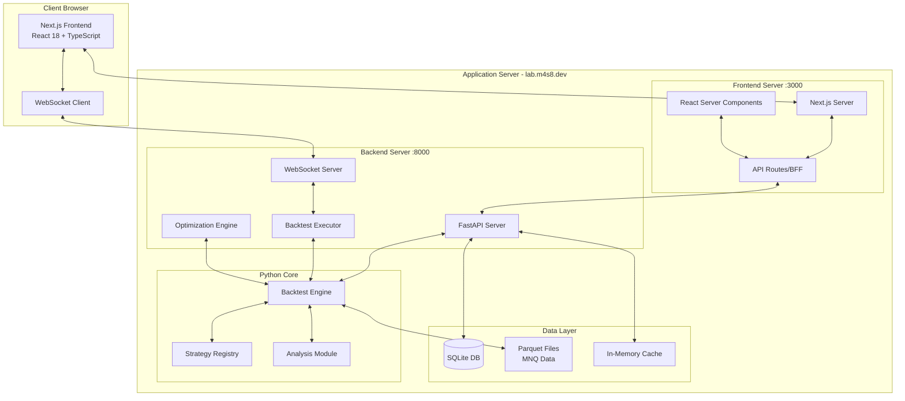

# 2. System Architecture Overview

## 2.1 High-Level Architecture

## 2.2 Component Responsibilities

| Component | Responsibility | Technology |
|-----------|---------------|------------|
| **Frontend** | UI rendering, user interactions | Next.js, React, TypeScript |
| **API Gateway** | Request routing, data aggregation | Next.js API Routes |
| **Backend API** | Business logic, data processing | FastAPI |
| **WebSocket Server** | Real-time updates, streaming | FastAPI WebSockets |
| **Backtest Engine** | Strategy execution, metrics | Python, hftbacktest |
| **Data Layer** | Persistence, caching | SQLite, Parquet, Memory |

---
