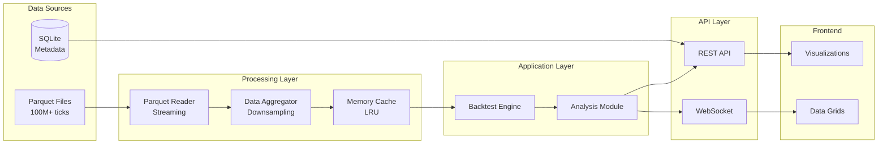

# 5. Data Architecture

## 5.1 Data Flow Architecture



## 5.2 Database Schema

```sql
-- SQLite Schema
CREATE TABLE backtests (
    id TEXT PRIMARY KEY,
    strategy_id TEXT NOT NULL,
    config JSON NOT NULL,
    status TEXT CHECK(status IN ('pending', 'running', 'completed', 'failed')),
    created_at TIMESTAMP DEFAULT CURRENT_TIMESTAMP,
    started_at TIMESTAMP,
    completed_at TIMESTAMP,
    error_message TEXT,
    result_path TEXT  -- Path to result files
);

CREATE TABLE backtest_results (
    id TEXT PRIMARY KEY,
    backtest_id TEXT REFERENCES backtests(id),
    metrics JSON NOT NULL,
    equity_curve BLOB,  -- Compressed array
    trades_count INTEGER,
    created_at TIMESTAMP DEFAULT CURRENT_TIMESTAMP
);

CREATE TABLE optimization_jobs (
    id TEXT PRIMARY KEY,
    strategy_id TEXT NOT NULL,
    type TEXT CHECK(type IN ('grid', 'genetic', 'walk_forward')),
    config JSON NOT NULL,
    status TEXT,
    best_params JSON,
    created_at TIMESTAMP DEFAULT CURRENT_TIMESTAMP,
    completed_at TIMESTAMP
);

CREATE TABLE user_preferences (
    key TEXT PRIMARY KEY,
    value JSON NOT NULL,
    updated_at TIMESTAMP DEFAULT CURRENT_TIMESTAMP
);

-- Indexes for performance
CREATE INDEX idx_backtests_status ON backtests(status);
CREATE INDEX idx_backtests_created ON backtests(created_at DESC);
CREATE INDEX idx_results_backtest ON backtest_results(backtest_id);
```

## 5.3 Caching Strategy

```python
