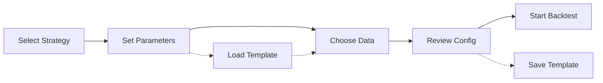

# Product Requirements Document (PRD) - UX Enhanced
# Strategy Lab Web UI for Backtesting Control, Analysis & Optimization

## 1. Executive Summary

### Product Vision
Create a powerful, single-user web interface for Strategy Lab that provides complete control over backtesting operations, advanced analysis capabilities, and strategy optimization - all running on a private server (lab.m4s8.dev) behind VPN for personal trading research.

### Key Objectives
- Provide fast, efficient control over backtesting execution without unnecessary overhead
- Enable deep analysis of trading performance with professional-grade visualizations
- Support rapid strategy iteration and parameter optimization
- Maximize performance and responsiveness for single-user workload
- Create a personalized trading research environment optimized for productivity

### 🎨 UX North Star
**"From idea to insight in seconds"** - Every interaction should minimize the cognitive load and time between trading hypothesis and actionable results.

## 2. User Journey & Experience

### 2.1 Primary User Flow
```
💡 Idea → ⚙️ Configure → 🏃 Execute → 📊 Analyze → 🔄 Iterate
```

#### Daily Workflow Pattern
1. **Morning Review** (5 min)
   - Dashboard overview of overnight runs
   - Quick performance check
   - System health verification

2. **Strategy Development** (2-4 hours)
   - Rapid parameter testing
   - Real-time monitoring
   - Quick iterations based on results

3. **Deep Analysis** (1-2 hours)
   - Trade-by-trade inspection
   - Pattern identification
   - Performance optimization

4. **Documentation** (30 min)
   - Export results
   - Note successful configurations
   - Plan next experiments

### 2.2 Key User Scenarios

#### Scenario A: Quick Strategy Test
- **Goal**: Test a new parameter idea quickly
- **Time**: < 2 minutes to start
- **Pain Points to Solve**:
  - Too many clicks to configure
  - Unclear what parameters changed
  - Waiting without feedback

**UX Solution**:
- One-click duplicate from last config
- Visual diff highlighting changes
- Real-time progress with meaningful ETAs

#### Scenario B: Comparative Analysis
- **Goal**: Compare multiple strategy variations
- **Time**: < 5 minutes to insights
- **Pain Points to Solve**:
  - Switching between results is cumbersome
  - Hard to spot meaningful differences
  - Can't see trends across variations

**UX Solution**:
- Split-screen comparison mode
- Synchronized chart interactions
- Automatic difference highlighting
- Saved comparison sets

#### Scenario C: Performance Deep Dive
- **Goal**: Understand why a strategy failed/succeeded
- **Time**: < 10 minutes to root cause
- **Pain Points to Solve**:
  - Too much data to parse manually
  - Unclear cause-effect relationships
  - Missing context for decisions

**UX Solution**:
- AI-assisted anomaly detection
- Interactive timeline with events
- Contextual trade annotations
- Pattern recognition highlights

## 3. Information Architecture

### 3.1 Navigation Hierarchy
```
┌─────────────────────────────────────┐
│         Global Command Bar          │  ← Cmd+K for anything
├─────────────────────────────────────┤
│ 📊 │ ⚙️ │ 🏃 │ 📈 │ 🔍 │ 🧪 │ ⚡ │  ← Primary Actions
├─────────────────────────────────────┤
│                                     │
│         Main Content Area           │  ← Context-aware workspace
│                                     │
├─────────────────────────────────────┤
│        Status Bar / Live Feed       │  ← Always visible system state
└─────────────────────────────────────┘
```

### 3.2 Mental Model Alignment
- **Workspace Metaphor**: Like a trading desk with multiple monitors
- **Tool Organization**: Grouped by workflow stage, not feature type
- **Data Presentation**: Progressive disclosure - overview → details → raw data

## 4. Interaction Design

### 4.1 Core Interaction Patterns

#### Direct Manipulation
- **Drag & Drop**: Parameters between configs, strategies to compare
- **Inline Editing**: Double-click any value to edit
- **Gestural Controls**: Pinch to zoom charts, swipe between results

#### Predictive Assistance
- **Smart Defaults**: Learn from usage patterns
- **Auto-complete**: Strategy names, parameter values
- **Suggested Actions**: "Users who ran this also..."

#### Responsive Feedback
- **Micro-animations**: Button states, loading indicators
- **Progress Communication**: Not just %, but meaningful stages
- **State Persistence**: Never lose work, auto-save everything

### 4.2 Keyboard-First Design
```
Essential Shortcuts:
Cmd+K     → Command palette
Cmd+Enter → Run backtest
Cmd+D     → Duplicate config
Cmd+/     → Toggle help
Space     → Play/pause execution
Esc       → Cancel/close
Tab       → Navigate fields
```

### 4.3 Error Prevention & Recovery
- **Validation**: Real-time, inline with helpful messages
- **Confirmation**: Only for destructive actions
- **Undo/Redo**: Full history with Cmd+Z/Cmd+Shift+Z
- **Auto-recovery**: Resume interrupted backtests

## 5. Visual Design System

### 5.1 Design Tokens
```css
/* Semantic Color System */
--color-profit: #10b981;     /* Green for gains */
--color-loss: #ef4444;       /* Red for losses */
--color-neutral: #6b7280;    /* Gray for no change */
--color-primary: #3b82f6;    /* Blue for actions */
--color-warning: #f59e0b;    /* Amber for warnings */
--color-surface: #1f2937;    /* Dark surface */
--color-background: #111827; /* Darker background */

/* Typography Scale */
--font-mono: 'JetBrains Mono', monospace;  /* Data */
--font-sans: 'Inter', sans-serif;          /* UI */

/* Spacing Rhythm */
--space-unit: 4px;  /* All spacing multiples of 4 */

/* Animation Timing */
--duration-instant: 100ms;
--duration-fast: 200ms;
--duration-normal: 300ms;
--easing-default: cubic-bezier(0.4, 0, 0.2, 1);
```

### 5.2 Component Patterns

#### Cards with Status
```
┌─────────────────────────┐
│ ● Status    Actions ⋮  │  ← Status indicator + quick actions
├─────────────────────────┤
│ Primary Info            │  ← Most important data large
│ Secondary Details       │  ← Supporting info smaller
│ ▓▓▓▓▓▓░░░░ 60%        │  ← Visual progress
└─────────────────────────┘
```

#### Data Tables
- Frozen columns for context
- Sortable headers with indicators
- Row highlighting on hover
- Inline actions on row hover
- Virtualized for performance

#### Charts
- Consistent color coding across all views
- Interactive tooltips with details
- Zoom/pan with preview
- Export as image/data
- Annotations layer

### 5.3 Responsive Behavior
- **1920px+**: Full desktop, all panels visible
- **1440px**: Slightly condensed, maintain all features
- **1280px**: Minimum supported, some panels collapse
- **< 1280px**: Show warning, provide mobile message

## 6. Data Visualization Excellence

### 6.1 Chart Selection Matrix
| Data Type | Best Visualization | Interaction |
|-----------|-------------------|-------------|
| Time series | Line chart with zoom | Brush to select range |
| Distribution | Histogram + box plot | Click for details |
| Correlation | Heatmap | Hover for values |
| Comparison | Grouped bar chart | Toggle datasets |
| Flow | Sankey diagram | Follow paths |
| Performance | Gauge + sparkline | Click for history |

### 6.2 Visual Hierarchy Rules
1. **Most important**: Largest, top-left, high contrast
2. **Supporting**: Medium size, center, medium contrast
3. **Details**: Smallest, bottom/right, low contrast
4. **Actions**: Always visible, consistent position
5. **Status**: Top-right corner, color-coded

## 7. Performance & Perceived Speed

### 7.1 Loading States
```
1. Skeleton screens for structure
2. Progressive data loading
3. Optimistic updates
4. Background prefetching
5. Stale-while-revalidate
```

### 7.2 Performance Budgets
- First Contentful Paint: < 200ms
- Time to Interactive: < 500ms
- Largest Contentful Paint: < 1s
- Cumulative Layout Shift: < 0.1
- First Input Delay: < 50ms

## 8. Accessibility & Usability

### 8.1 Accessibility Standards
- **Keyboard**: Full keyboard navigation
- **Screen Readers**: ARIA labels and live regions
- **Color**: Not sole indicator, 4.5:1 contrast minimum
- **Focus**: Clear focus indicators
- **Motion**: Respects prefers-reduced-motion

### 8.2 Usability Heuristics
1. **Visibility**: System status always visible
2. **Match**: Use trading terminology correctly
3. **Control**: User in control, can cancel anything
4. **Consistency**: Same patterns throughout
5. **Prevention**: Prevent errors before they happen
6. **Recognition**: Don't make users remember
7. **Flexibility**: Shortcuts for power users
8. **Minimalism**: Remove unnecessary elements
9. **Recovery**: Clear error messages with solutions
10. **Help**: Contextual help available

## 9. Detailed UI Specifications

### 9.1 Dashboard Page
```typescript
interface DashboardLayout {
  header: {
    height: 64,
    sticky: true,
    contents: ['logo', 'nav', 'command', 'status']
  },
  grid: {
    columns: 12,
    gap: 16,
    areas: {
      metrics: { col: [1, 8], row: [1, 2] },
      activity: { col: [9, 12], row: [1, 2] },
      chart: { col: [1, 8], row: [3, 6] },
      strategies: { col: [9, 12], row: [3, 4] },
      queue: { col: [9, 12], row: [5, 6] }
    }
  }
}
```

### 9.2 Configuration Flow


### 9.3 Results Analysis Layout
- **Split View**: Chart top (60%), metrics bottom (40%)
- **Tabs**: Overview | Trades | Risk | Comparison
- **Filters**: Sidebar with collapsible sections
- **Export**: Floating action button bottom-right

## 10. Micro-interactions & Delight

### 10.1 Meaningful Animations
- **Progress**: Smooth fills, not jumps
- **Transitions**: Slide between views
- **Feedback**: Pulse on success, shake on error
- **Loading**: Skeleton → fade in content
- **Hover**: Subtle elevation change

### 10.2 Delightful Details
- **Success**: Confetti on record-breaking performance
- **Milestones**: Achievement badges for usage
- **Shortcuts**: Toast notifications for learning
- **Empty States**: Helpful, not boring
- **Easter Eggs**: Hidden features for exploration

## 11. Design System Components

### 11.1 Core Components Library
```
Atoms:
- Button (primary, secondary, ghost, danger)
- Input (text, number, select, date)
- Badge (status, count, label)
- Icon (consistent 24px set)
- Tooltip (hover, click, focus)

Molecules:
- Card (stat, action, info)
- Table (data, sortable, selectable)
- Chart (line, bar, scatter, heatmap)
- Form (field groups, validation)
- Alert (info, success, warning, error)

Organisms:
- Navigation (sidebar, tabs, breadcrumb)
- Dashboard (widget, grid, responsive)
- Modal (dialog, drawer, popover)
- DataGrid (virtual, editable, exportable)
- Workspace (panels, resizable, dockable)
```

## 12. Future UX Enhancements

### 12.1 Intelligence Layer
- **Predictive Analytics**: "This configuration likely to..."
- **Anomaly Detection**: Highlight unusual patterns
- **Smart Suggestions**: Based on historical success
- **Natural Language**: "Show me winning trades on Mondays"

### 12.2 Collaboration Features
- **Annotations**: Add notes to specific points
- **Bookmarks**: Save interesting states
- **Templates**: Share successful configs
- **Reports**: Generate branded PDFs

### 12.3 Advanced Visualizations
- **3D Surfaces**: Parameter optimization space
- **Network Graphs**: Strategy relationships
- **Time-lapse**: Replay market sessions
- **VR Mode**: Immersive data exploration (future)

## 13. UX Success Metrics

### 13.1 Efficiency Metrics
- Task completion time reduction: > 50%
- Clicks per task: < 5 average
- Error rate: < 1%
- Time to first backtest: < 60 seconds

### 13.2 Satisfaction Metrics
- SUS Score: > 85 (Excellent)
- NPS: > 70 (World-class)
- Daily active use: > 90%
- Feature adoption: > 80%

### 13.3 Engagement Metrics
- Session duration: 2-4 hours optimal
- Actions per session: > 50
- Return rate: Daily
- Advanced feature usage: > 60%

---

**Document Version**: 2.0 UX Enhanced
**Last Updated**: 2025-08-06
**UX Lead**: Sally (UX Expert)
**Status**: Comprehensive UX Specification
**Target**: Single power user on private infrastructure

## Appendix: UI Component Examples

### A. Command Palette Design
```
┌──────────────────────────────────────┐
│ 🔍 Type a command or search...       │
├──────────────────────────────────────┤
│ Recent                               │
│ ▶ Run Last Backtest          Cmd+R  │
│ 📊 View Results              Cmd+1   │
├──────────────────────────────────────┤
│ Actions                              │
│ ⚙️ Configure Strategy               │
│ 📈 Compare Results                  │
│ 💾 Export Data                      │
└──────────────────────────────────────┘
```

### B. Status Bar Information
```
[●] Connected | CPU: 45% | MEM: 2.1GB | Queue: 3 | ▶ Running: OrderBookScalper | ETA: 2:34
```

### C. Smart Notifications
```
✅ Backtest Complete - New Personal Best!
   OrderBookScalper achieved 2.4 Sharpe Ratio
   [View Results] [Run Again] [Share Config]
```
