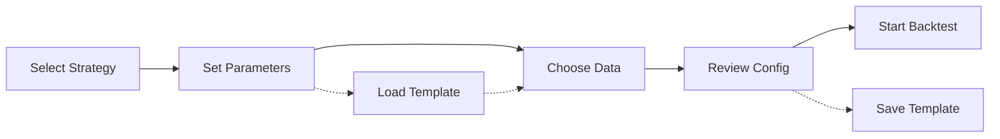

# 9. Detailed UI Specifications

## 9.1 Dashboard Page
```typescript
interface DashboardLayout {
  header: {
    height: 64,
    sticky: true,
    contents: ['logo', 'nav', 'command', 'status']
  },
  grid: {
    columns: 12,
    gap: 16,
    areas: {
      metrics: { col: [1, 8], row: [1, 2] },
      activity: { col: [9, 12], row: [1, 2] },
      chart: { col: [1, 8], row: [3, 6] },
      strategies: { col: [9, 12], row: [3, 4] },
      queue: { col: [9, 12], row: [5, 6] }
    }
  }
}
```

## 9.2 Configuration Flow


## 9.3 Results Analysis Layout
- **Split View**: Chart top (60%), metrics bottom (40%)
- **Tabs**: Overview | Trades | Risk | Comparison
- **Filters**: Sidebar with collapsible sections
- **Export**: Floating action button bottom-right
