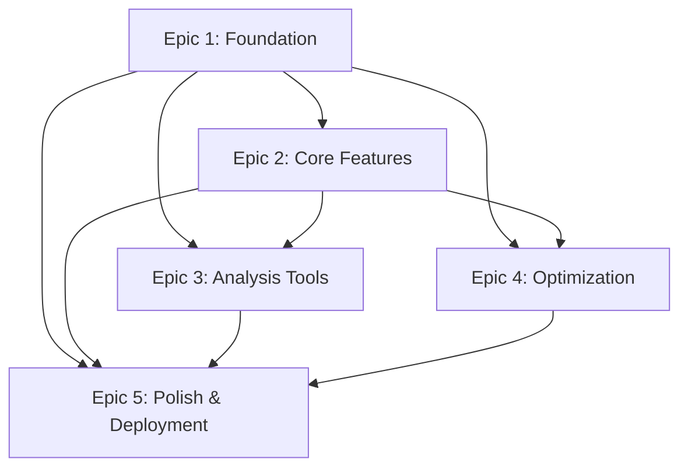

# Strategy Lab Web UI - Epic Overview

This document provides an overview of all epics for the Strategy Lab Web UI project, organized by implementation phase and priority.

## 📋 Epic Summary

| Epic | Name | Duration | Story Points | Dependencies |
|------|------|----------|--------------|--------------|
| [Epic 1](./epic-1-foundation.md) | Foundation Infrastructure | 1-2 weeks | 21 | None |
| [Epic 2](./epic-2-core-features.md) | Core Backtesting Features | 2-3 weeks | 34 | Epic 1 |
| [Epic 3](./epic-3-analysis-tools.md) | Advanced Analysis & Visualization | 3-4 weeks | 42 | Epic 1, 2 |
| [Epic 4](./epic-4-optimization-module.md) | Strategy Optimization Module | 4-5 weeks | 48 | Epic 1, 2 |
| [Epic 5](./epic-5-polish-deployment.md) | Polish, Performance & Production | 2-3 weeks | 35 | Epic 1-4 |

**Total Project Duration**: 12-17 weeks
**Total Story Points**: 180

## 🎯 Implementation Strategy

### Phase 1: Foundation (Weeks 1-2)
- **Epic 1**: Foundation Infrastructure
- **Goal**: Establish technical foundation for development
- **Deliverables**: Next.js frontend, FastAPI backend, WebSocket connectivity, dev environment

### Phase 2: Core Functionality (Weeks 3-5)
- **Epic 2**: Core Backtesting Features
- **Goal**: Enable basic backtesting workflow through web interface
- **Deliverables**: Dashboard, configuration UI, execution control, basic results

### Phase 3: Advanced Features (Weeks 6-13)
- **Epic 3**: Advanced Analysis & Visualization (Weeks 6-9)
- **Epic 4**: Strategy Optimization Module (Weeks 10-13)
- **Goal**: Provide comprehensive analysis and optimization capabilities
- **Deliverables**: Interactive charts, trade explorer, optimization tools

### Phase 4: Production Ready (Weeks 14-17)
- **Epic 5**: Polish, Performance & Production Deployment
- **Goal**: Production-ready application with professional polish
- **Deliverables**: Optimized performance, error handling, monitoring, deployment automation

## 🚀 Parallel Development Opportunities

### Frontend & Backend Split
- **Frontend Team**: Focus on UI components, charts, and user interactions
- **Backend Team**: Focus on API development, data processing, and optimization algorithms

### Epic 3 & 4 Parallelization
- **Analysis Team**: Epic 3 - Interactive visualizations and trade analysis
- **Optimization Team**: Epic 4 - Parameter optimization and algorithmic improvements

## 📊 Story Distribution by Category

### Frontend Stories (React/Next.js with shadcn/ui)
- **User Interface**: 15 stories (built with shadcn/ui components)
- **Charts & Visualization**: 8 stories (using shadcn/ui Chart components)
- **User Experience**: 6 stories (leveraging shadcn/ui design system)
- **Total Frontend**: 29 stories (96 story points)

### Backend Stories (FastAPI/Python)
- **API Development**: 12 stories
- **Data Processing**: 8 stories
- **Optimization Algorithms**: 6 stories
- **Total Backend**: 26 stories (84 story points)

### Infrastructure & DevOps
- **Development Environment**: 3 stories
- **Deployment & Monitoring**: 4 stories
- **Security & Performance**: 4 stories
- **Total Infrastructure**: 11 stories (35 story points)

## 🔧 Technical Integration Points

### Cross-Epic Dependencies
1. **WebSocket Infrastructure** (Epic 1) → **Real-time Updates** (Epic 2-4)
2. **Chart Components** (Epic 2) → **Advanced Visualizations** (Epic 3)
3. **Backtest Execution** (Epic 2) → **Optimization Jobs** (Epic 4)
4. **Performance Optimization** (Epic 5) affects all previous epics

### External System Integrations
- **Strategy Lab Python Backend**: Core backtesting engine integration
- **MNQ Parquet Data**: Market data file system integration
- **SQLite Database**: Results and configuration persistence
- **VPN Infrastructure**: Security and network access

## 📈 Success Criteria by Epic

### Epic 1: Foundation
- [ ] Development environment functional
- [ ] Basic connectivity established
- [ ] Team can begin feature development

### Epic 2: Core Features
- [ ] Complete backtest workflow functional
- [ ] 2-minute end-to-end execution time
- [ ] Real-time progress monitoring

### Epic 3: Analysis Tools
- [ ] Interactive analysis with 1M+ data points
- [ ] Trade exploration and pattern identification
- [ ] Professional-grade visualizations

### Epic 4: Optimization
- [ ] Automated parameter optimization
- [ ] 10x improvement in parameter discovery
- [ ] Multiple optimization algorithms available

### Epic 5: Production Ready
- [ ] 99.9% uptime in production
- [ ] Sub-1-second page load times
- [ ] Comprehensive monitoring and alerting

## 🎨 User Experience Journey

### Week 2: Basic Functionality
- User can configure and run backtests
- Basic results visualization available
- Real-time progress monitoring

### Week 5: Core Workflow Complete
- Full backtesting workflow polished
- Dashboard provides system overview
- Export and basic analysis available

### Week 9: Advanced Analysis
- Deep trade-level analysis
- Interactive charts and visualizations
- Strategy comparison capabilities

### Week 13: Optimization Complete
- Automated parameter optimization
- Advanced optimization algorithms
- 3D parameter surface visualization

### Week 17: Production Ready
- Professional-grade application
- Optimized performance
- Comprehensive monitoring

## 📋 Epic Dependencies Graph

## 🔄 Iteration & Feedback Cycles

### Sprint Structure (2-week sprints)
- **Sprint 1**: Epic 1 (Foundation)
- **Sprint 2-3**: Epic 2 (Core Features)
- **Sprint 4-5**: Epic 3 (Analysis Tools)
- **Sprint 6-7**: Epic 4 (Optimization)
- **Sprint 8**: Epic 5 (Polish & Deployment)

### Review Points
- End of each epic: Demo and stakeholder feedback
- Mid-epic: Technical review and course correction
- Pre-deployment: Comprehensive QA and user acceptance

---

**Document Version**: 1.0
**Last Updated**: 2025-08-06
**Project Manager**: John (PM)
**Total Estimated Duration**: 12-17 weeks
